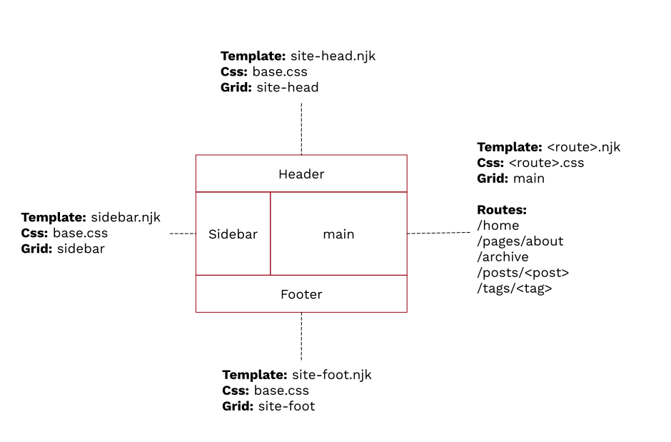

# 11ty Crayon Starter

A starter [Eleventy](https://www.11ty.dev/) blog/website ptoject.

## Usage

### Local development

```bash
npm i
npm start
```

### Production 

```bash
npm run production
```

## Commands

### Css linting

```bash
npm run css-lint
```

## How it works

The end site is generated by [Eleventy](https://www.11ty.io). It uses [Nunjucks](https://mozilla.github.io/nunjucks/) as it's templating language. This site is derived and inspired from the [Hylia](https://github.com/hankchizljaw/hylia) eleventy theme.


* Css is raw, no frameworks - see [src/_includes/css](src/_includes/css). The css is injected directly into `<style>` tags at build time. 
* Css linting uses https://stylelint.io.
* Actual content lives in: [src/posts](src/posts) and [src/pages](src/pages).
* See [src/_data](src/_data) for custom js - also [src/filters](src/filters), [src/utils](src/utils) and [src/transforms](src/transforms).
* See [src/_includes](src/_includes) for all the numjuck templates & layout.
* See [.eleventy.js](.eleventy.js) in terms of what it processes and what it doesn't.

### Site layout



### Posts

There is a directory per post, and that directory should contain everything within that post; content, images, pdfs, etc. This containment makes it easy to manage content as everything is in the one place and there is no magic. 

There should be one .md file per post, see any of the examples in [src/posts](src/posts). To create a new post, create a new folder, create a markdown file that will be your post and drop in whatever else your post references. Note the front matter:

```
---
title: A simple post
date: '2021-04-17'
tags:
  - demo-content
  - simple-post
  - blog
introImage: computer.jpg
seoDescription: "A short simple post"
---
```

### Images

#### Intro Images
Each post has an `introImage` field. This special image is used as a thumbnail in the list of posts, and also as the 'hero image' in the post itself. These images should be a specific size and format to match what the css expects. There is a script to help with this. 

When adding an intro image for a post, use `npm process-images ./src/posts/<post>/<image>`. This does the following:
1) create a thumbnail, <image>-thumbnail.jpg.
2) create a webp optimised image for the main page itself, <image>-optimised.webp
2) create a jpg optimised image for the main page itself, <image>-optimised.jpg

By convention, these processed images are picked up by the templates/css based on the name of the `introImage` field.

For example:

```
npm run process-intro-image -- ./src/posts/enhanced-photos/london-enhanced.jpg
```

Generates:
```
london-enhanced.jpg-intro-image.jpg  42K
london-enhanced.jpg-intro-image.webp 33K
london-enhanced.jpg-thumbnail.jpg  6.5K
```

Quite the reduction in size from Our original file:

`london-enhanced.jpg                1.6M`

These are specific sizes, optimised to the css in the posts templates. 

Under the hood, the intro images use the [picture](https://developer.mozilla.org/en-US/docs/Web/HTML/Element/picture) element. 

For our example above:

```
<picture>
  <source srcset="london-enhanced.jpg-intro-image.webp" type="image/webp">
  <source srcset="london-enhanced.jpg-intro-image.jpg" type="image/jpeg">
  
</picture>
```

#### Images in posts

There is no magic image processing for any other images; images need to be processed by the author and then then final optimised image referenced in the markdown. This gives full control over images; there is no silver bullet for image processing, you need to optimise for what you are showing. 

Images can be processed externally in any photo editor, or there can be processed from the command line with some built in helper tools. 

To create an optimised version of a typical photo you'd take from a camera phone:

```bash
npm run process-image -- ./src/posts/enhanced-photos/london-enhanced.jpg
```

This creates a 700x500 versions of this photo, in jpg and webp formats. It also spits out a picture element that you can paste directly into your markdown:

```
<picture>
  <source srcset="london-enhanced.jpg-700-500.webp" type="image/webp">
  <source srcset="london-enhanced.jpg-700-500.jpg" type="image/jpeg">
  
</picture>
```

You can also use sharp directly from the command line:

```bash
./node_modules/.bin/sharp -i ./src/images/posts/webcam2.jpg -o ./src/images/posts/webcam2-700x500.webp resize 700 500
./src/images/posts/webcam2-700x500.webp
```

The above will shrink an image from 2M down to 31KB. 

