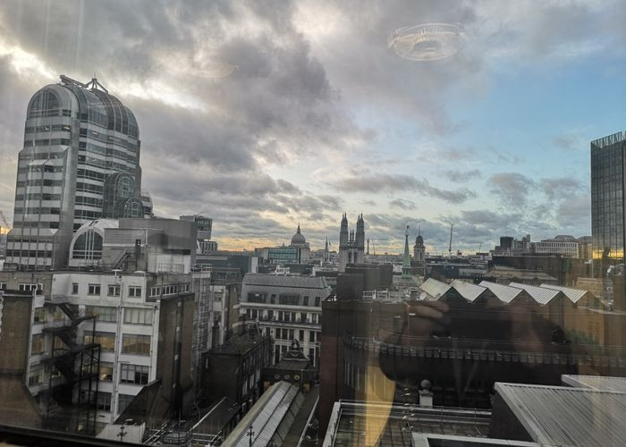
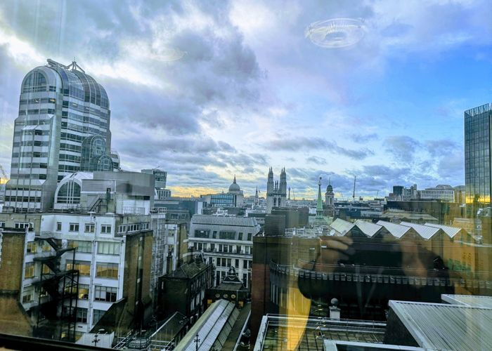

Google does an amazing job at enhancing photos. Here is the original of a photo I took in London recently..

<!-- excerpt -->

<picture>
  <source srcset="london-original.jpg-700-500.webp" type="image/webp">
  <source srcset="london-original.jpg-700-500.jpg" type="image/jpeg">
  
</picture>

And here is the image that popped out of Google Photos on my phone a few days later:

<picture>
  <source srcset="london-enhanced.jpg-700-500.webp" type="image/webp">
  <source srcset="london-enhanced.jpg-700-500.jpg" type="image/jpeg">
  
</picture>

Good job google! You can read more about Google Photos [here](https://en.wikipedia.org/wiki/Google_Photos)
